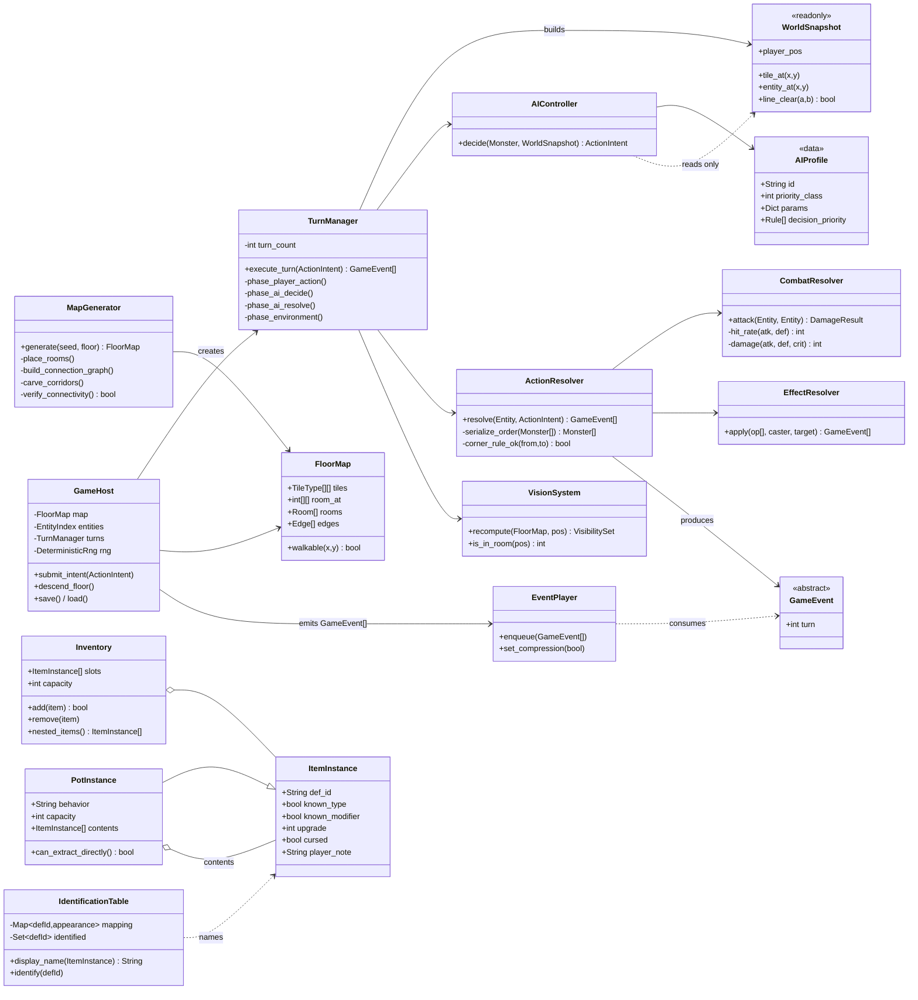

# 系統架構規劃 v0.1 —— 先架構，後代碼

配套：`docs/roguelike_dungeon_GDD.md`（機制規格）、`docs/roguelike_data_spec.md`（資料表）

本文件是**寫任何引擎程式碼之前必須先確認的東西**。確認架構無誤後，引擎層的實作只是把已驗證的邏輯搬過去。

---

## 0. 最高原則：Model 不認識引擎

三層，依賴方向嚴格單向：

```
┌────────────────────────────────────────────────────────┐
│  View（呈現層）  Godot Node / Unity MonoBehaviour        │
│  只讀 GameEvent，永不反向寫 Model                        │
└───────────────────────▲────────────────────────────────┘
                        │ GameEvent[]
┌───────────────────────┴────────────────────────────────┐
│  Host（轉接層）  唯一同時認識 Core 與引擎的一層           │
│  輸入 → Intent → 驅動 TurnManager → 取回事件串 → 派發    │
└───────────────────────▲────────────────────────────────┘
                        │ ActionIntent
┌───────────────────────┴────────────────────────────────┐
│  Core（模型層）  純資料 + 純函式                          │
│  不 import 任何引擎 API，可在 CI headless 跑             │
└────────────────────────────────────────────────────────┘
```

**單向資料流**：

```
玩家輸入 ──► ActionIntent ──► Core.TurnManager.execute_turn()
                                        │
                                        ▼
                              GameEvent[]（有序、完整的一回合）
                                        │
                                        ▼
                              EventPlayer（排程動畫）──► View
                                        │
                                        ▼
                              動畫播完 ──► 解鎖下一次輸入
```

**為什麼一定要這樣**：GDD §1.7 要求「邏輯層在 1 個 frame 內跑完整個回合，表現層再播動畫」。若 View 能寫 Model，長按方向鍵壓縮動畫時必然出現「動畫還在播、狀態已經又變了」的競態，玩家會看到怪物瞬移、傷害數字對不上。**把它變成架構上不可能發生的事，比之後除錯便宜得多。**

---

## 1. 模組樹

```
core/                        ← 純邏輯，零引擎依賴
├── grid/
│   ├── TileType.*           WALL / ROOM_FLOOR / CORRIDOR / STAIRS_UP / STAIRS_DOWN / WATER
│   ├── Room.*               rect、zone、doors[]
│   ├── Zone.*               3x3 區域定義
│   ├── FloorMap.*           tiles / room_at / rooms / junctions / edges + 物件層
│   └── MapGenerator.*       ★ 見 docs/roguelike_mapgen.md
├── entity/
│   ├── Entity.*             id / pos / hp / atk / def / speed / gauge / statuses
│   ├── Player.*             + level / exp / satiety / inventory / equipment
│   ├── Monster.*            + ai_profile_id / traits
│   └── EntityIndex.*        依 id 查、依座標查（雜湊空間索引，O(1) 佔位判定）
├── turn/
│   ├── ActionIntent.*       MOVE / ATTACK / USE_ITEM / THROW / EQUIP / PICKUP / STAIRS / WAIT
│   ├── TurnManager.*        ★ 回合階段機 P0~P9（GDD §1.3）
│   ├── SpeedGauge.*         行動點累積器、倍速前後半子回合（GDD §1.4）
│   └── ActionResolver.*     Intent → 狀態變更 + GameEvent
├── ai/
│   ├── AIProfile.*          CHASER / WANDERER / RANGED 的參數
│   ├── AIController.*       decide(monster, snapshot) → ActionIntent
│   └── WorldSnapshot.*      ★ P3 結束時的唯讀快照（同步性的保證）
├── item/
│   ├── ItemDef.* / ItemInstance.*
│   ├── ItemDatabase.*       載入 items.json
│   ├── Inventory.*          20 格 + 壺內容（巢狀容器）
│   ├── IdentificationTable.* 每局外觀映射 + 已鑑定集合 + 玩家標註
│   └── EffectResolver.*     執行 effects op 陣列
├── vision/
│   └── VisionSystem.*       ★ 房間全揭露 / 通道 1 格（見 §5）
├── combat/
│   └── CombatResolver.*     命中 / 會心 / 傷害公式
├── rng/
│   └── DeterministicRng.*   ★ 唯一亂數來源，種子化、可重播
└── event/
    └── GameEvent.*          ★ Model → View 的唯一通道

host/
└── GameHost.*               持有 Core 狀態；接輸入、驅動回合、派發事件、存檔

view/
├── MapRenderer.*            TileMapLayer / Tilemap 繪製地形
├── EntityView.*             精靈與位移插值
├── FogRenderer.*            未探索 / 已探索未見 / 可見 三態
├── EventPlayer.*            ★ GameEvent 佇列 → 動畫排程與壓縮
└── ui/
    ├── InventoryUI.*        背包、壺內容、右鍵選單
    ├── MessageLog.*
    └── StatusBar.*          HP / 飽足度 / 樓層 / 等級
```

---

## 2. 類別圖



---

## 3. GameEvent 契約

Model 與 View 之間**只准透過這張表溝通**。新增機制時先加事件，再加 View 反應。

| 事件 | 主要欄位 | View 反應 | 可壓縮 |
|---|---|---|---|
| `EntityMoved` | entity_id, from, to, is_sub_turn | 位移插值 120ms | ✔ 40ms |
| `EntityAttacked` | attacker_id, target_id, hit | 揮擊動畫 | ✔ |
| `DamageDealt` | target_id, amount, is_crit, source | 跳字、受擊閃爍、震動 | ✖ 會心不可壓縮 |
| `EntityDied` | entity_id, killer_id | 消散動畫、經驗值飄字 | ✔ |
| `HpChanged` | entity_id, from, to | 血條補間 | ✔ |
| `SatietyChanged` | from, to, threshold_crossed | 數值列變色、警告音 | ✖ 跨閾值時 |
| `StatusAdded` / `StatusRemoved` | entity_id, status, duration | 圖示、粒子 | ✔ |
| `ItemPickedUp` / `ItemDropped` | item_id, pos | 圖示飛入背包 | ✔ |
| `ItemUsed` | item_id, verb（吃/讀/揮/投） | 使用動畫 + 訊息 | ✖ |
| `ItemIdentified` | def_id, appearance, true_name | **全背包同種名稱刷新** | ✖ |
| `ItemThrown` | item_id, from, to, hit_entity | 拋物線飛行 | ✔ |
| `VisibilityChanged` | newly_visible[], newly_hidden[], newly_explored[] | 霧效重繪 | ✔ |
| `TrapTriggered` | trap_id, pos, entity_id | 陷阱動畫 | ✖ |
| `FloorChanged` | floor_index, seed | 換場轉場 | ✖ |
| `MonsterSpawned` | entity_id, pos, reason | （視野外則無表現） | ✔ |
| `MessageLogged` | text, severity | 訊息列 | ✔ |
| `TurnAdvanced` | turn_count | 回合計數 UI | ✔ |
| `PlayerDied` | cause, killer, record | 死亡結算畫面 | ✖ |

**壓縮規則**（GDD §1.7）：`EventPlayer` 在連續移動時把可壓縮事件縮到 40ms；但只要佇列中出現任一不可壓縮事件、或玩家 HP < 30%、或視野內有敵人，該回合**強制全速播放**。

---

## 4. 各模組的職責與禁止事項

| 模組 | 必須做 | **禁止** |
|---|---|---|
| `MapGenerator` | 產生 FloorMap、驗證連通性 | 不得引用 Entity / Item 實例（只放 id） |
| `TurnManager` | 依 P0~P9 推進、產生事件 | 不得直接改 View、不得呼叫 `rand()`（只能用注入的 `DeterministicRng`） |
| `AIController` | 讀 Snapshot 產生 Intent | **不得寫入任何世界狀態**（決策與執行必須分離） |
| `ActionResolver` | 執行 Intent、序列化衝突 | 不得重跑 AI 決策（目標被佔走時只走 fallback） |
| `VisionSystem` | 計算可見集合 | 不得決定「畫成什麼樣」（那是 FogRenderer 的事） |
| `IdentificationTable` | 外觀映射、顯示名 | 不得被 View 直接改寫 |
| `EventPlayer` | 排程動畫 | 不得回寫 Core 狀態 |
| `InventoryUI` | 顯示、蒐集玩家選擇 | **不得直接改 Inventory** —— 必須送出 Intent 交由 Core 執行 |

> 最後一條是你貼的 `InventoryUI.gd` 目前的主要架構問題：`_execute_put_into_pot()` 直接 `inventory.erase()` 又直接 `pot.contents.append()`。UI 改了資料，Core 完全不知情 → 這一步不會消耗回合、不會產生事件、不會進存檔、不會被重播記錄。詳見 §7 的 review。

---

## 5. 視野系統的資料需求（先確認契約，實作在下一階段）

`FloorMap.room_at[y][x]` 這個欄位就是為視野系統存在的 —— 它讓「我在不在房間裡」變成 O(1) 查表，而不是每回合對所有房間做矩形測試。

```
FUNCTION recompute_visibility(map, player_pos):
    visible = {}
    room_id = map.room_at[player_pos.y][player_pos.x]

    IF room_id >= 0:
        # 在房間內 → 揭露整間房 + 房間外圍一圈牆 + 所有門口
        room = map.rooms[room_id]
        visible += all_tiles_in(room)
        visible += surrounding_wall_ring(room)      # 讓玩家看得到房間形狀
        visible += room.doors                       # 門口必須可見，否則找不到出口
    ELSE:
        # 在通道 / 門口 → 只看得到周圍 1 格（8 鄰域）
        visible += neighbours_8(player_pos) + {player_pos}

    explored += visible                             # 已探索：永久記錄，霧色顯示
    RETURN VisibilitySet{ visible, explored }
```

三態渲染（`FogRenderer`）：

| 狀態 | 條件 | 呈現 |
|---|---|---|
| 未探索 | 不在 `explored` | 全黑，不繪製 |
| 已探索・當前不可見 | 在 `explored`，不在 `visible` | 地形以 40% 亮度繪製；**不顯示怪物與道具**（記憶只記地形） |
| 可見 | 在 `visible` | 全亮，繪製所有實體 |

> **「已探索但不可見時不顯示怪物」是關鍵**：如果玩家能看到記憶中的怪物位置，走廊戰術就失去了資訊不對稱，「不知道轉角後面有什麼」的緊張感會消失。

---

## 6. 這樣切的三個具體收益

1. **平衡驗證可自動化**：Core 沒有引擎依賴 → 可以在 CI 跑「10000 場模擬 Run」，直接產出 GDD §5.2 那五個埋點指標（餓死率、未鑑定道具使用率、樓層探索完成度…）。`mapgen_reference.py` 已經是這條路的第一步。
2. **存檔 = Core 狀態序列化**：不含任何節點、不含任何場景路徑 → 版本升級時不會因為改了節點樹而讓舊存檔失效。
3. **重播 = seed + Intent 序列**：因為所有亂數走 `DeterministicRng`、AI 決策是純函式、衝突排序不用亂數（GDD §1.5 的 `spawn_id` tie-break），完整一場 Run 可以用 `(run_seed, intent[])` 重現。Bug 回報只要附這兩樣。

---

## 7. 對現有壺系統程式碼的 review

你貼的 `PotSystem.cs` / `InventoryUI.gd` 邏輯方向正確，但有幾處會在實機出問題：

### 編譯不過
- **`PotSystem.cs` 換金之壺**：`int goldAmount = targetItem.Value * (1 + targetItem.Enhancement * 0.2f);` —— `float` 不能隱式轉 `int`。需 `int goldAmount = (int)(targetItem.Value * (1 + targetItem.Enhancement * 0.2f));`
- **`PotItem.gd`**：`override func get_display_name()` —— GDScript 2.0 **沒有 `override` 關鍵字**，直接寫 `func get_display_name()` 即可（子類同名函式自動覆寫）。

### 邏輯錯誤
- **`ProcessSynthesis` 取錯材料**：`Item ingredientItem = pot.Contents[1];` 註解寫「最新放入的物品」，但索引 1 只在內容物恰為 2 件時才是最新。一旦某次合成失敗（型別不合、不執行 `RemoveAt`），內容物累積到 3 件後就會一直拿到同一件舊物品。應改為 `pot.Contents[pot.Contents.Count - 1]`。
- **強化值無上限**：`baseItem.Enhancement += ingredientItem.Enhancement;` 沒有夾到武器的 `upgrade_range` 上限。配合複製壺會直接讓數值失控。應 `Math.Min(sum, def.UpgradeMax)`。
- **`_break_pot` 溢位**：壺內物品全部倒回 `inventory` 而未檢查 20 格上限。正確行為應是**散落到地面**（你的 C# 版 `BreakPot` 做對了，GDScript 版沒有）。
- **`_on_pot_content_item_clicked` 用了過期索引**：`inventory[selected_item_index]` —— 若中途背包有增減，索引已失效。應持有壺的**參考**而非索引。
- **`_execute_put_into_pot` 繞過所有檢查**：沒驗 `is_full()`、沒驗壺的行為型別（合成壺 / 吸物壺的分支邏輯完全沒跑）。選單雖然會禁用按鈕，但拖放路徑與程式呼叫路徑都能繞過 —— 檢查應該在**資料層**做，不是在 UI 層做。
- **`_can_drop_data` 只擋了「放進自己」**：傳統規則是**任何壺都不能放進壺**（否則巢狀容器會讓背包上限失去意義）。應改為 `data["item"] is PotItem → return false`。

### 架構問題（最重要）
UI 直接改資料。所有這些操作都應該走：

```
InventoryUI 蒐集玩家選擇
      ↓ 送出
ActionIntent{ type: USE_ITEM, verb: PUT_INTO_POT, item, pot }
      ↓
GameHost → TurnManager.execute_turn()      ← 這裡才消耗 1 回合、怪物才會行動
      ↓
GameEvent[]{ ItemMovedIntoPot, ItemIdentified, MessageLogged }
      ↓
InventoryUI.refresh()
```

現在的寫法讓「放東西進壺」變成免費動作 —— 但依 GDD §1.2，它應該消耗 1 回合，怪物要同步行動一次。**這正是 Model/View 分離要解決的問題**：不是為了漂亮，是為了讓回合制的規則無處可逃。

---

## 8. 實作順序（依賴排序）

| 階段 | 內容 | 產出驗收 |
|---|---|---|
| **A** | `core/rng` + `core/grid` + `MapGenerator` | 移植 `mapgen_reference.py`；2000 seed 連通性測試全過 |
| **B** | `core/entity` + `core/turn`（P0~P9）+ Host 骨架 | 玩家能在生成的圖上走動；`turn_ended` 正確觸發 |
| **C** | `view/MapRenderer` + `EntityView` + `EventPlayer` | 圖畫得出來、移動有插值、連打會壓縮 |
| **D** | `core/vision` + `view/FogRenderer` | 進房間全亮、走通道只見 1 格 |
| **E** | `core/ai`（三種 profile）+ `core/combat` | 怪物會追、會遊蕩、會射；傷害符合 `data_spec §3` |
| **F** | `core/item` + `Inventory` + `IdentificationTable` + `InventoryUI` | 吃／讀／揮／投四種動詞可用；未鑑定名稱正確 |
| **G** | 壺（巢狀容器）+ 合成 + 死亡結算 | 完整一場 Run 可以跑到死 |

A→B→C 是骨幹，D 之後可以並行。
